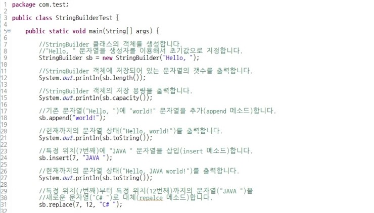
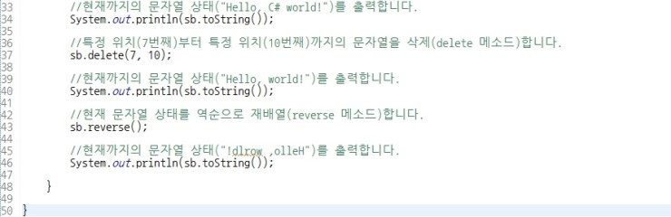

# 자주 실수하는 것들 모음

## 함수에 배열을 인자로 넘겨줄 때
 - 함수에 배열을 인자로 넘겨주고, 작업한 뒤의 배열을 어딘가에 저장할 때, 새로운 배열을 하나 선언해서 만든 후 저장해야 한다.
 - 배열을 새로 선언하지 않고 저장하면, 이후의 작업들이 배열의 같은 공간을 참조하므로 배열 내부 데이터가 계속 변화하게 된다.
 - ex) 프로그래머스 DFS/BFS 여행 경로 문제 참고

## 향상된 auto for 문 사용할 때
 - auto for 문의 경우 특정 값을 출력할 때만 사용하자
 - 배열의 값을 update 할 때는 auto for 문은 부적합하다.(배열의 값을 바꿔줄 수 없음)

## Priority Queue 에서 remove() 메소드를 사용하여 큐 내부 특정 값을 제거할 수 있다.(Priority Queue 뿐만 아니라, Deque 와 Stack 에서도 사용가능하다)
 - Stack 이나 Queue 또는 ArrayList 등에서 remove 를 사용할 때, <Integer> 를 Object로 받는 경우에는 remove(int index) 와 remove(object o) 가 있기 때문에 잘 구분해서 사용할 수 있어야 한다.
  + 특정 Integer 값을 remove 하고 싶은 경우, arr.remove(Integer.parseInt(1000)) 과 같은 형태로, Integer 값을 인자로 넘겨줘야 한다.
  + 그냥 arr.remove(2) 를 하면 remove(int index) 가 호출된다.

## Queue 사용 시 Deque<> = new ArrayDeque<>(); 형태로 사용한다.

## 각 정수형의 최댓값, 최솟값을 구하고 싶을 경우
 - 각 정수형의 래퍼클래스에는 MIN_VALUE, MAX_VALUE라는 상수값이 저장되어 있다.
 - Integer.MAX_VALUE, Integer.MIN_VALUE, Long.MAX_VALUE, Long.MIN_VALUE 형태로 사용할 수 있다.

## Graph 알고리즘들
 - Floyd-Warshall
 - Dijkstra

## JAVA SCANNER INPUT 시 nextLine()이 안먹히는 경우
 - When you input a value (whether String, int, double, etc...) and hit 'enter,' a new-line character (aka '\n') will be appended to the end of your input. So, if you're entering an int, sc.nextInt() will only read the integer entered and leave the '\n' behind in the buffer. So, the way to fix this is to add a sc.nextLine() that will read the leftover and throw it away. This is why you need to have that one line of code in your program
 - nextInt() 를 사용한 후 nextLine()을 사용하는 코드에서, 1을 누른 후 엔터를 누르면, nextInt()는 1까지만 인식하고 넘어가므로, '\n'가 남게 된다. 이것이 남아 있으므로 nextLine() 값에 이 개행문자가 들어가게 되어 작동이 안하는 것처럼 보인다.

## Java 입출력 - BufferedReader 와 StringTokenizer 활용
 - BufferedReader, StringTokenizer는 입력값을 String으로 한번에 받아오므로, Scanner 보다 시간 복잡도 측면에서 효율적이다.
 - 한 줄마다 st = new STringTokenizer(br.readLine()); 을 통해 String 값을 받는다.
 - 빈 줄일 경우 개행문자만 들어오므로, 이에 주의한다.
 ```java
 BufferedReader br = new BufferedReader(new InputStreamReader(System.in));
 StringTokenizer st = new StringTokenizer(br.readLine());

 // AB CDD EFFF GH 입력
 st.nextToken(); // AB
 st.nextToken(); // CDD
 st.nextToken(); // EFFF
 st.nextToken(); // GH
 ```

## 정렬
 **Sorting of an array of primitive values with a custom comparator is not supported by the standard Java libraries**
 **custom comparator 를 사용한 primitive type 의 array sorting은 Standard Java Library 에서 지원하지 않음**
 **Primitive values array 의 경우 오름차순 정렬만 가능**
 - Arrays.sort 를 사용할 때 int 와 Integer
 - int의 경우 Comparator를 지정할 수 없음.
 - Integer의 경우 Comparator 지정이 가능함. 
 - Int vs Integer
  + int 
   - primitive 자료형(long, float, double...)
   - 산술 연산이 가능하다.
   - null로 초기화 할 수 없다.
  + Integer
   - Wrapper 클래스(객체)
   - Unboxing을 해서 int형으로 바꾸지 않으면 산술 연산이 불가능하지만, null 값 처리가 가능하다
   - null 값 처리가 용이하므로 SQL과 연동할 경우 처리가 용이하다.
   - DB에서 자료형이 정수이지만 null 값이 필요한 경우 VO 에서 Integer를 사용할 수 있음.
 - Integer.valueOf(String) --> Integer 반환
 - Integer.parseInt(String) --> int 반환

## String to Int, Int to String
 - String to Int
  + Integer.parseInt(*str value*)
 - String to Integer
  + Integer.valueOf(*str value*)
 - Integer(Int) to String
  + String.valueOf(*Intgr value*)

## StringBuilder
 - String을 append 하여 String을 만들어야 할 경우, StringBuilder를 사용한다.
 - StringBuilder sb = new StringBuilder();
 - sb.append(*str value*)
 - String answer = sb.toString();

 
 