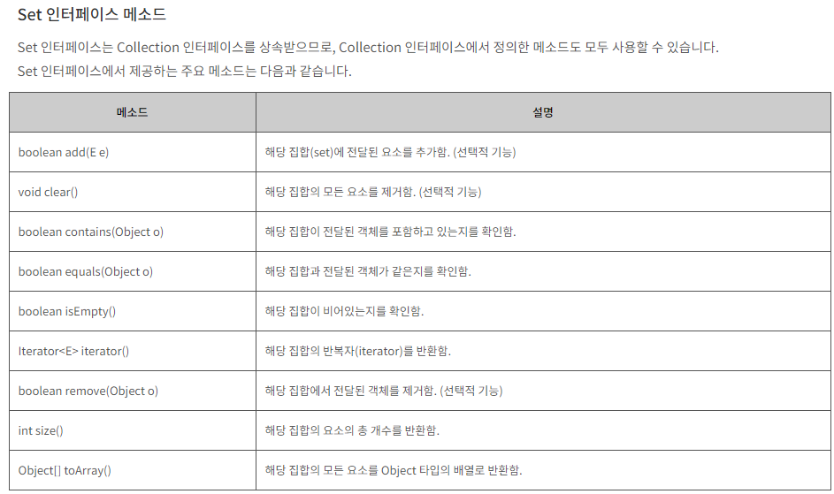

## HashSet
 - HashSet 클래스는 Set 컬렉션 클래스에서 가장 많이 사용되는 클래스 중 하나이다.
 - 내부적으로 HashMap 인스턴스를 이용하여 요소를 저장한다.
 - 요소를 순서에 상관없이 저장하고 중복된 값은 저장하지 않는다.
 - 요소의 저장 순서를 유지해야 한다면, LinkedHashSet 클래스를 이용한다.

```java
import java.util.HashSet;
import java.util.Scanner;

public class BOJ3052{
    public static void main(String[] args){

        int input[] = new int[10];

        HashSet<Integer> hs = new HashSet<Integer>();

        Scanner sc = new Scanner(System.in);

        for(int i=0; i<10; i++){
            input[i] = (sc.nextInt() % 42);
            hs.add(input[i]);
        }

        System.out.println(hs.size());


    }
}
```
 - HashSet Methods
 

 ## Advanced For 문을 이용한 HashSet 순회
 ```java
 import java.util.HashSet;
import java.util.Scanner;

public class BOJ3052{
    public static void main(String[] args){

        int input[] = new int[10];

        HashSet<Integer> hs = new HashSet<Integer>();

        Scanner sc = new Scanner(System.in);

        for(int i=0; i<10; i++){
            input[i] = (sc.nextInt() % 42);
            hs.add(input[i]);
        }

        System.out.println(hs.size());

        System.out.println("======HashSet Traverse=====");

        for(int a : hs){
            System.out.print( a + " ");
        }


    }
}
 ```
